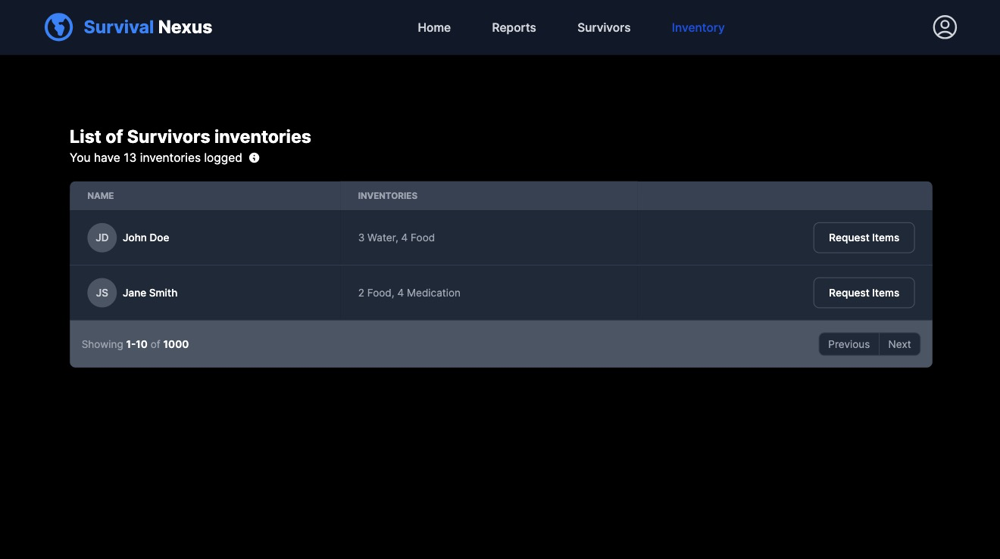

# Survival Nexus Application

This web application allows the resistance to manage their resources and coordinate their efforts in a post-apocalyptic world. It provides functionality to create survivors, list survivors, list survivors' inventories, and more.

Note: This is a [Next.js](https://nextjs.org/) project bootstrapped with [`create-next-app`](https://github.com/vercel/next.js/tree/canary/packages/create-next-app).

## Features

- Create survivor: Allows adding new survivors.
- List survivors: Displays a list of all survivors.
- List survivors' inventories: Displays the inventories of all survivors.
- Reports:
  - Percentage of infected survivors.
  - Percentage of non-infected survivors.
  - Average amount of each kind of resource by survivor.
- **Dark theme support:** The application supports dark mode (system settings).
- **Work with server components where possible:** Users server components where applicable to optimize server-side rendering and improve performance.
  

## Technologies Used

- Frontend: Next.js 14 with React (Typescript)
- Styling: Tailwind CSS

## Mocked Services

The application uses mocked services for survivors and items since there is no real backend for APIs. These services provide sample data for testing and development purposes.

## Getting Started

Clone the repository:

```bash
git clone https://github.com/jorgeperezn/Survival-nexus-world.git
```

Install dependencies:

```bash
npm install
```

Run the development server:

```bash
npm run dev
```

The application should now be running on http://localhost:3000.

## Possible Improvements

- **Handle switch for light/dark theme**: Currently, the application only takes the theme from the system preferences. Enhance the theme switching functionality to allow users to manually switch between light and dark themes.

- **Integrate Redux** (or other state management library): Implement a state management library like Redux to handle the application state more efficiently, especially when dealing with complex data and interactions.

- **Work with real APIs**: Replace the mocked services with real APIs to fetch data from a backend server, enabling the application to work with real-time data and interact with external systems.

